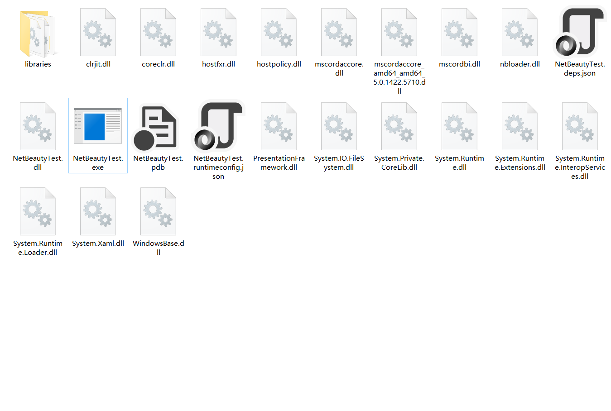
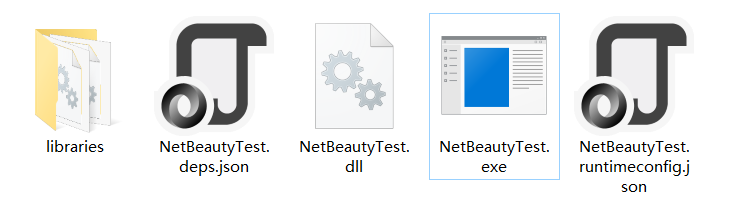
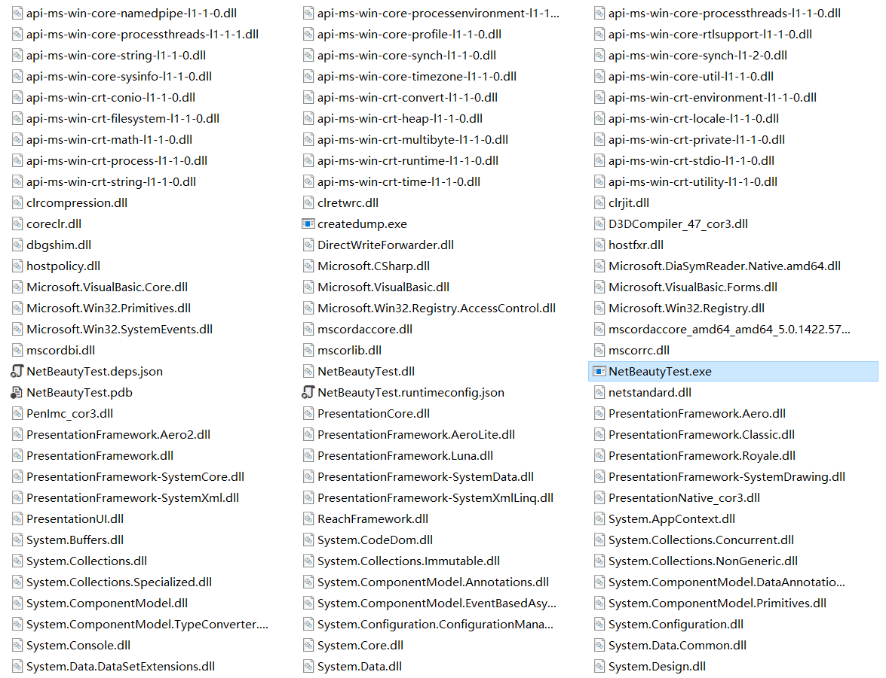

# NetBeauty 2

## What is it?
NetBeauty moves a .NET Framework/.NET Core app runtime components and dependencies into a sub-directory and make it beauty.

### After Beauty


**EVEN LESS!**

see [`--hiddens`](#use-the-binary-application-if-your-project-has-already-been-published) option



### Before Beauty


## What's New?
|  | [NetBeauty 2](https://github.com/nulastudio/NetBeauty2) | [NetCoreBeauty](https://github.com/nulastudio/NetBeauty2/tree/v1) |
| ---- | ---- | ---- |
| Supported Framework | `.Net Framework`(not completed yet)<br/>`.Net Core 3.0+` | `.Net Core 2.0+` |
| Supported Deployment Model | Framework-dependent deployment (`FDD`)<br/>Self-contained deployment (`SCD`)<br/>Framework-dependent executables (`FDE`) | Self-contained deployment (`SCD`) |
| Supported System | All | `win-x64` `win-x86`<br/>`linux-x64` `linux-arm` `linux-arm64`<br/>`osx-x64` |
| Need Patched HostFXR | No | Yes |
| Minimum Structure | ~20 Files | ~8 Files |
| How It Works | [`STARTUP_HOOKS`](https://github.com/dotnet/runtime/blob/main/docs/design/features/host-startup-hook.md)<br/>[`AssemblyLoadContext.Resolving`](https://docs.microsoft.com/en-us/dotnet/api/system.runtime.loader.assemblyloadcontext.resolving?view=netcore-3.0)<br/>[`AssemblyLoadContext.ResolvingUnmanagedDll`](https://docs.microsoft.com/en-us/dotnet/api/system.runtime.loader.assemblyloadcontext.resolvingunmanageddll?view=netcore-3.0) | [`patched libhostfxr`](https://github.com/nulastudio/HostFXRPatcher)<br/>[`additionalProbingPaths`](https://github.com/dotnet/toolset/blob/master/Documentation/specs/runtime-configuration-file.md#runtimeoptions-section-runtimeconfigjson) |
| Shared Runtime | Coming Soon | Possible If Using `patched libhostfxr` Alone |

## How to use?
### Add Nuget reference into your .NET Core project.
```
dotnet add package nulastudio.NetBeauty
```
Your `*.csproj` should be similar to this
```xml
<Project Sdk="Microsoft.NET.Sdk">

  <PropertyGroup>
    <OutputType>Exe</OutputType>
    <TargetFramework>netcoreapp3.0</TargetFramework>
  </PropertyGroup>

  <PropertyGroup>
    <!-- beauty into sub-directory, default is libs, quote with "" if contains space  -->
    <BeautyLibsDir>libraries</BeautyLibsDir>
    <!-- dlls that you don't want to be moved or can not be moved -->
    <!-- <BeautyExcludes>dll1.dll;lib*;...</BeautyExcludes> -->
    <!-- dlls that end users never needed, so hide them -->
    <!-- <BeautyHiddens>hostfxr;hostpolicy;*.deps.json;*.runtimeconfig*.json</BeautyHiddens> -->
    <!-- <BeautyAfterTasks></BeautyAfterTasks> -->
    <!-- valid values: Error|Detail|Info -->
    <BeautyLogLevel>Info</BeautyLogLevel>
  </PropertyGroup>

  <ItemGroup>
    <PackageReference Include="nulastudio.NetBeauty" Version="2.0.0.0-beta.1" />
  </ItemGroup>

</Project>
```
When you run `dotnet publish`, everything is done automatically.

### Use the binary application if your project has already been published.
```
Usage:
nbeauty2 [--loglevel=(Error|Detail|Info)] [--hiddens=<hiddenFiles>] <beautyDir> [<libsDir> [<excludes>]]
```

for example
```
ncbeauty2 --hiddens "hostfxr;hostpolicy;*.deps.json;*.runtimeconfig*.json" /path/to/publishDir libraries "dll1.dll;lib*;..."
```


**`--hiddens` option just hiding the files, not moving them, and only works under Windows!**


### Install as a .NETCore Global Tool
```
dotnet tool install --global nulastudio.nbeauty
```
then use it just like binary distribution.
