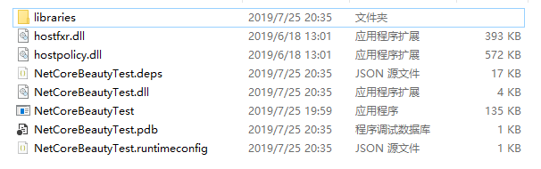
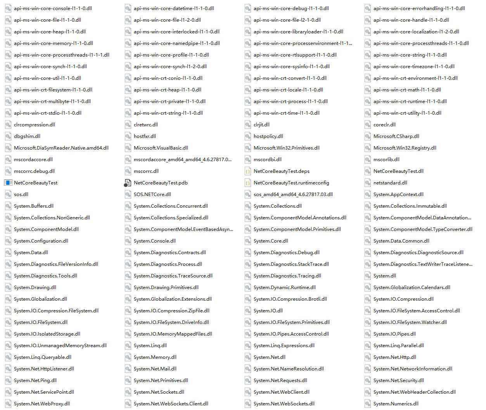

# NetCoreBeauty

## What is it?
NetCoreBeauty moves .NET Core app runtime components and dependencies into a sub-directory to make it beautiful.

### After Beauty


### Before Beauty


## Why And Why Not?
1. WHY NOT [Single-file Publishing](https://docs.microsoft.com/en-us/dotnet/core/whats-new/dotnet-core-3-0#single-file-executables)?

   First, you cannot use it in `.Net Core 2.x`, obviously. Second, single-file app publishing will extract everything into a temporary directory and run it from that location. For that reason, a portable app is impossible if you are using `Assembly.GetEntryAssembly().Location` to store persistent data. This is not an issue with Beauty, but netcore single-file publishing.

2. WHY NOT [Fody/Costura](https://github.com/Fody/Costura)?

   [Fody/Costura](https://github.com/Fody/Costura) is fantastic project, but there are some reasons why you might not want to use it. First, it modifies IL code which will have possibly unpredictable effects. Second, you need to make assemblies become `embedded resources`, which is extra work, and in some cases, may cause issues. I encountered this issue, and it was difficult to find the culprit. Third, it adds a layer of complication to a project, more points of failure, and without knowing exactly what the tool is changing, a developer can't easily fix the errors.

3. WHY NOT [Warp](https://github.com/dgiagio/warp)?

   Like `Single-file Publish`, it does not extract data into the current directory. It extracts into `%APPDATA%`, so a portable app is still impossible. 
In addition, `Warp` cannot set the icon or assembly information, and it won't use the information from the original app after extraction.

4. WHY NOT [ILMerge](https://github.com/dotnet/ILMerge)?

   It merges multiple assemblies into a single assembly. It needs to modify your assemblies, adding possible namespace or reflection errors. You can still can re-sign all your assemblies to use strong names, though. It's also Windows only

5. WHY NOT [AppHostPatcher](https://github.com/0xd4d/dnSpy/tree/master/Build/AppHostPatcher)?

   AppHostPatcher has a similar goal as `ncbeauty`, but has a little problem. Data is stored inside `APP_BASE/sub-dir`, not `APP_BASE` directly. That is because `apphost`'s main assembly has been moved into `APP_BASE/sub-dir`, and the actual `APP_BASE` has changed to `APP_BASE/sub-dir`. Like the other projects, it can possibly cause unexpected behavior.

6. WHY [NetCoreBeauty](https://github.com/nulastudio/NetCoreBeauty)?

   NCBeauty has a single and simple goal. It does nothing to your project and assemblies. It only organizes your app's directory, so you need to do nothing but reference the NuGet package.

## How?
Theoretically, loading assemblies from a subdirectory should be natively supported ([see `additionalProbingPaths` setting under `runtimeOptions`](https://github.com/dotnet/toolset/blob/master/Documentation/specs/runtime-configuration-file.md#runtimeoptions-section-runtimeconfigjson)), but setting `additionalProbingPaths` in `.runtimeconfig.json` has a serious problem. The host does not resolve the relative path from `APP_BASE`, but the current working directory, therefore, we cannot execute the app outside of `APP_BASE`. This means that the only way to run the app is via a terminal with `cd APP_BASE & ./executable`. Running from the file explorer would fail. [HostFXRPatcher](https://github.com/nulastudio/HostFXRPatcher) fixes this problem by rebuilding the corehost. When publishing, `ncbeauty` will try to download the specific patched hostfxr and modify `.runtimeconfig.json` and `.deps.json`. That is why `ncbeauty` only works with [self-contained deployments mode](https://docs.microsoft.com/en-us/dotnet/core/deploying/#self-contained-deployments-scd). Why not PR? Because this fix breaks lots of things, so a merge is not going to happen in a short time. `.NET` community already plan to fix in `.NET 5`.

## Limitation
Only works with [Self-Contained Deployments mode(SCD)](https://docs.microsoft.com/en-us/dotnet/core/deploying/#self-contained-deployments-scd)

目前仅适用于[独立部署发布模式](https://docs.microsoft.com/zh-cn/dotnet/core/deploying/#self-contained-deployments-scd)的程序

## Patched-Runtime Versions
`2.x` `3.x`, no `5.x` yet.

## Supported OS
OS      | Architectures
--------|--------------
Windows | x64, x86
Linux   | x64, arm, arm64
MacOS   | x64

## Change Log
see [Change LOG.md](CHANGELOG.md)

## How to use?
### Add Nuget reference into your .NET Core project.
```
dotnet add package nulastudio.NetCoreBeauty
```
Your `*.csproj` should be similar to this
```xml
<Project Sdk="Microsoft.NET.Sdk">

  <PropertyGroup>
    <OutputType>Exe</OutputType>
    <TargetFramework>netcoreapp2.1</TargetFramework>
    <!-- beauty into sub-directory, default is libs, quote with "" if contains space  -->
    <BeautyLibsDir>libraries</BeautyLibsDir>
    <!-- dlls that you don't want to be moved or can not be moved -->
    <!-- <BeautyExcludes>dll1.dll;lib*;...</BeautyExcludes> -->
    <!-- set to True if you want to disable -->
    <DisableBeauty>False</DisableBeauty>
    <ForceBeauty>False</ForceBeauty>
    <!-- <BeautyAfterTasks></BeautyAfterTasks> -->
    <!-- set to True if you want to disable -->
    <DisablePatch>False</DisablePatch>
    <!-- valid values: Error|Detail|Info -->
    <BeautyLogLevel>Error</BeautyLogLevel>
    <!-- set to a repo mirror if you have troble in connecting github -->
    <!-- <GitCDN>https://gitee.com/liesauer/HostFXRPatcher</GitCDN> -->
    <!-- <GitTree>master</GitTree> -->
  </PropertyGroup>

  <ItemGroup>
    <PackageReference Include="nulastudio.NetCoreBeauty" />
  </ItemGroup>

</Project>
```
When you run `dotnet publish -r` (only works with `SCD` mode), everything is done automatically.

### Use the binary application if your project has already been published.
```
Usage:
ncbeauty [--force=(True|False)] [--gitcdn=<gitcdn>] [--gittree=<gittree>] [--loglevel=(Error|Detail|Info)] [--nopatch=(True|False)] <beautyDir> [<libsDir> [<excludes>]]

Setting GitCDN:
ncbeauty [--loglevel=(Error|Detail|Info)] setcdn <gitcdn>
ncbeauty [--loglevel=(Error|Detail|Info)] getcdn
ncbeauty [--loglevel=(Error|Detail|Info)] delcdn
```
for example
```
ncbeauty /path/to/publishDir libraries "dll1.dll;lib*;..."
```

### Install as a .NETCore Global Tool
```
dotnet tool install --global nulastudio.ncbeauty
```
then use it just like binary distribution.

## Mirror
If you have trouble connecting to github, use this mirror
```
https://gitee.com/liesauer/HostFXRPatcher
```

## Default Git CDN
`ncbeauty` [1.2.1](https://github.com/nulastudio/NetCoreBeauty/releases/tag/v1.2.1) supports setting default Git CDN now, so you don't need to `--gitcdn` all the time if you are using the binary distribution. The default git cdn can still be overriden with `--gitcdn`.
Usage:
```
ncbeauty [--loglevel=(Error|Detail|Info)] setcdn <gitcdn>
  set current default git cdn, can be override by --gitcdn.
ncbeauty [--loglevel=(Error|Detail|Info)] getcdn
  print current default git cdn.
ncbeauty [--loglevel=(Error|Detail|Info)] delcdn
  remove current default git cdn, after removed, use --gitcdn to specify.
```

## Git Tree
Use `--gittree` to specify a valid git branch or any git commit hash (up to 40) to grab the specific artifacts and you won't get updates any more.
The default always uses the latest artifacts.

NOTE: please provide as long of a commit hash as you can, otherwise it may can not be determined as a valid unique commit hash.

NOTE: PLEASE DO NOT USE ANY COMMIT THAT OLDER THEN `995a9774a75975510b352c1935e232c9e2d5b190`

examples:
```
master
feature/xxx
995a977
995a9774a7
995a9774a75975510b352c1935e232c9e2d5b190
```
